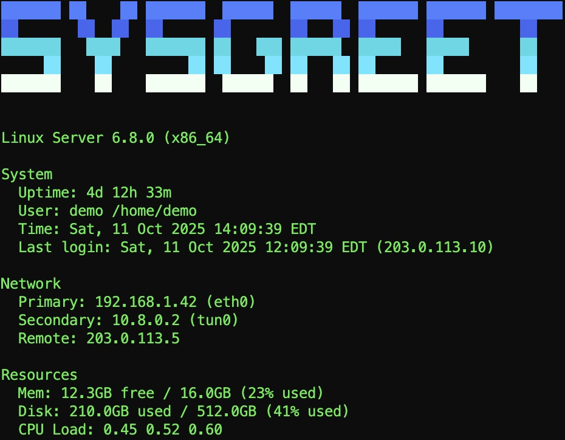

# Sysgreet

> Beautiful, low-latency system context for every terminal login.


Sysgreet keeps you oriented the moment a shell prompt appears. It prints the
hostname in ASCII art alongside a curated snapshot of operating system,
network, and resource telemetry, so you always know **which** machine you are on
and **whether** it is healthy. Built for managing home labs and fleets alike, it
remains lightweight, offline-friendly, and cross-platform across Linux, macOS,
and Windows.

---

## Why Sysgreet exists

I created Sysgreet while operating a growing home lab and juggling
multiple SSH sessions. I wanted a professional banner (_not_ a novelty) that
instantly answered three questions:

1. **Where am I logged in?** (Hostname, OS, architecture, remote source)
2. **Is this host behaving?** (Uptime, memory, disk, CPU trends)
3. **What network path am I on?** (Primary route, relevant secondary interfaces)

Sysgreet delivers those answers in under 50 ms without calling out to the
network or depending on external runtimes.

---

## Highlights

- **Single static binary** - Go 1.22+, no CGO, no daemons, no service
  dependencies.
- **Cross-platform parity** - Linux/macOS show load averages; Windows surfaces
  CPU usage. Interface filtering avoids noisy virtual adapters everywhere.
- **Configurable yet optional** - YAML or TOML profiles toggle sections, pick
  fonts/colors, set layout order, and cap the interface list. Defaults "just
  work" with zero files.
- **Graceful degradation** - Missing metrics or SSH metadata simply fall back;
  the banner keeps rendering.
- **Performance-guarded** - Startup benchmark (<50 ms median, <80 ms p95) runs in
  CI; process RSS stays <15 MB.
- **Professional aesthetics** - Unicode block fonts with gradient colors,
  automatic monochrome fallback, 80-column mindful layout.

---

## Quick start

### Install the binary

```bash
# Via Go (requires Go 1.22+)
go install github.com/veteranbv/sysgreet/cmd/sysgreet@latest

# Ensure Go's bin directory is in your PATH
# Add this to ~/.bashrc, ~/.zshrc, or equivalent if not already present:
export PATH="$HOME/go/bin:$PATH"

# Or download a release artifact (Linux/macOS/Windows, amd64 & arm64)
# https://github.com/veteranbv/sysgreet/releases
```

> _Tip:_ The binary runs entirely offline. Copy it between hosts without
> worrying about external assets.

### Update to latest version

```bash
# Via Go (silent on success)
go install github.com/veteranbv/sysgreet/cmd/sysgreet@latest

# Verify the update
sysgreet --version

# Or download the latest release
# https://github.com/veteranbv/sysgreet/releases
```

### Wire into your shell

| Shell            | Snippet                                                                                       |
|------------------|------------------------------------------------------------------------------------------------|
| Bash / Zsh       | `echo 'sysgreet' >> ~/.bashrc` (or `~/.zshrc`)                                                 |
| Fish             | `echo 'sysgreet' >> ~/.config/fish/config.fish`                                               |
| PowerShell       | `Add-Content $PROFILE 'sysgreet'`                                                             |
| Windows Terminal | Add `sysgreet` to your profile script so it runs after each session attaches                  |
| SSH `ForceCommand` | `ForceCommand /usr/local/bin/sysgreet && /bin/bash` (keeps banner even when no profile runs) |

**Special modes:**

```bash
# Demo mode - show 'SYSGREET' with fake data (perfect for screenshots)
sysgreet --demo

# Text mode - render custom ASCII art
sysgreet --text "Production DB"

# Disable output (useful in CI/scripts)
sysgreet --disable
```

---

## Configuration (optional)

Sysgreet looks for configuration in this order:

1. `SYSGREET_CONFIG` environment variable (absolute or `~/` paths)
2. `~/.config/sysgreet/config.yaml` (or `.yml`, `.toml`)
3. `~/.sysgreet.yaml` / `.toml`

Example YAML:

```yaml
# ~/.config/sysgreet/config.yaml
ascii:
  font: "ANSI Regular"
  gradient: ["brightblue", "blue", "cyan", "brightcyan", "white"]
  monochrome: false

display:
  hostname: true
  os: true
  ip_addresses: true
  remote_ip: true
  uptime: true
  user: true
  memory: true
  disk: true
  load: true
  datetime: true
  last_login: true

layout:
  compact: false
  sections: ["header", "network", "system", "resources"]

network:
  show_interface_names: true
  max_interfaces: 4
```

Environment variables override everything (e.g.
`SYSGREET_DISPLAY_MEMORY=false`, `SYSGREET_ASCII_FONT=standard`). See
[`configs/example.yaml`](configs/example.yaml) and
[`configs/example.toml`](configs/example.toml) for full references.

### Bootstrap behaviour

- First run: sysgreet writes `~/.config/sysgreet/config.yaml` with curated defaults (all sections enabled, `ANSI Regular` font with blue-to-white gradient, metadata fields `created_at` and `version`).
- Existing config: sysgreet leaves the file untouched by default. Provide `--config-policy prompt` (or `SYSGREET_CONFIG_POLICY=prompt`) to surface the `[K]eep/[O]verwrite/[C]ancel` flow, or `overwrite` to regenerate the defaults (a timestamped `.bak` is created first).
- Non-interactive automation: use `--config-policy` or `SYSGREET_CONFIG_POLICY` to choose `prompt`, `keep`, or `overwrite`. When stdin is not a TTY (e.g. CI jobs), an explicit policy is required.
- Flags beat environment variables so scripts can override fleet defaults (`SYSGREET_CONFIG_POLICY=overwrite bin/sysgreet --config-policy=keep`).

---

## What the banner shows



- **System** - Hostname (ASCII art), OS name/version, architecture, uptime,
  active user + home, current time, last login when available.
- **Network** - Primary outbound interface based on routing table, filtered list
  of secondary physical interfaces, SSH remote IP (from `SSH_CONNECTION` or
  `SSH_CLIENT`). Loopback, link-local, Docker/VM, and down interfaces stay out of
  view by default.
- **Resources** - Memory, disk, and CPU metrics with highlight thresholds (≥75% in
  yellow, ≥90% in red). Windows surfaces realtime CPU usage; Unix hosts show load
  averages.

---

## Performance guarantees

- **Startup** - `< 50 ms` median, `< 80 ms` p95 (validated by
  `go test -bench Startup ./test/benchmarks`)
- **Binary footprint** - `< 10 MB` for all release targets (GoReleaser checks)
- **Runtime memory** - `< 15 MB` RSS for default banner
- **No network activity** - All data collected locally, offline-safe

Enable `SYSGREET_DEBUG=1` to log collector errors without interrupting output.

---

## Development & contribution

See [CONTRIBUTING.md](CONTRIBUTING.md) for detailed development guidelines, code standards, and workflow.

**Quick start:**

```bash
git clone https://github.com/veteranbv/sysgreet.git
cd sysgreet
go mod tidy
make test
make bench
```

**Common tasks:**

```bash
make fmt            # Format code
make lint           # Run linters (requires golangci-lint)
make test-coverage  # Run tests with coverage report
make build          # Build the binary
```

PRs are welcome. Please open an issue describing new collectors, layout ideas, or
platform-specific improvements before diving in.

---

## Release process

- CI (`.github/workflows/ci.yml`) runs `golangci-lint`, unit tests with race
  detection, integration tests, and validates startup performance (<80ms p95).
- Releases use GoReleaser (`.goreleaser.yml`) to ship signed binaries for
  Linux/macOS (amd64/arm64) and Windows (amd64), plus checksums.
- `go install github.com/veteranbv/sysgreet@VERSION` is validated during the
  release workflow.

---

## Roadmap

- Optional JSON output for scripting in CI/CD pipelines
- Extended GPU/storage telemetry for workstation profiles
- Pluggable section framework (e.g., Kubernetes context, vault status)
- Prebuilt Windows installer for enterprise onboarding

Ideas welcome. Open a discussion if a feature would make Sysgreet more useful for
your fleet.

---

## License

Sysgreet is licensed under the [Apache License 2.0](LICENSE).

Copyright © 2025 Henry Sowell
